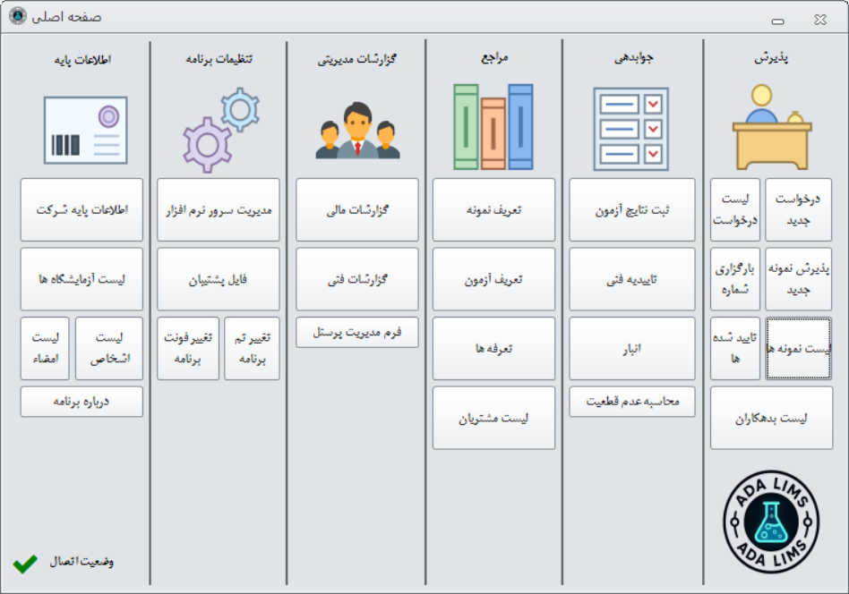
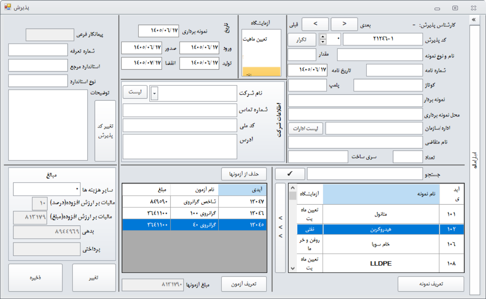
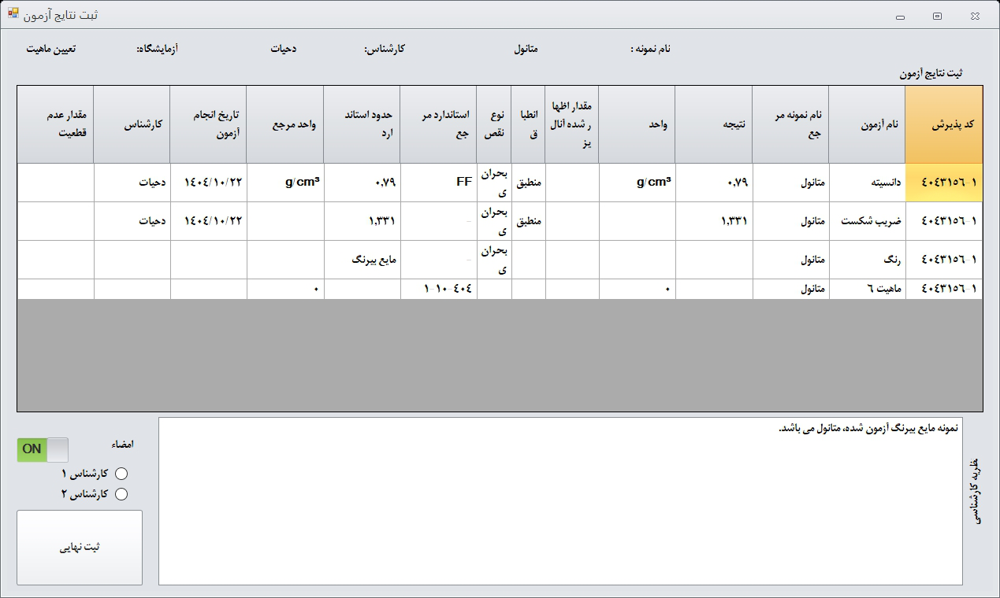
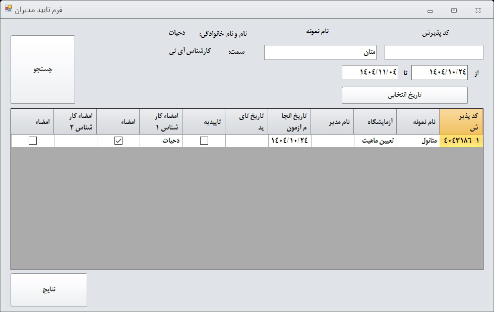
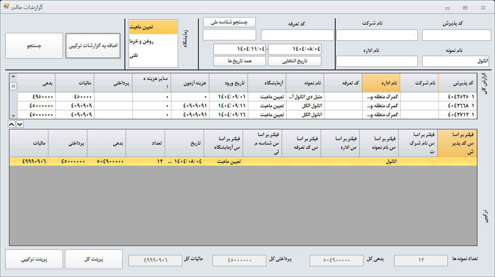
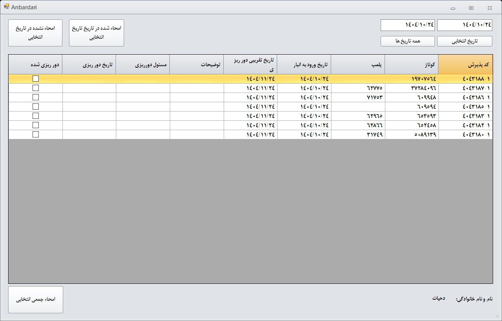

# 🧪 سامانه مدیریت و پذیرش آزمایشگاه (ADALims)

---

## 📌 معرفی

**ADALims** (که با نام **PazireshAPP** نیز شناخته می‌شود) یک نرم‌افزار جامع و حرفه‌ای برای **مدیریت یکپارچه‌ی فرایندهای آزمایشگاهی** است. این سیستم با هدف خودکارسازی عملیات روزمره‌ی آزمایشگاه‌های همکار با سازمان استاندارد طراحی شده و قابلیت‌های زیر را پوشش می‌دهد:

- پذیرش نمونه‌ها  
- تعریف آزمون‌ها و ثبت نتایج  
- تأییدیه‌های فنی و امضای دیجیتال  
- مدیریت مالی، صدور فاکتور و پیگیری پرداخت‌ها  
- گزارش‌گیری پیشرفته (مالی، فنی، مدیریتی)  
- مدیریت انبار نمونه‌ها  
- محاسبه‌ی عدم‌قطعیت اندازه‌گیری  
- مدیریت کاربران و دسترسی‌ها  
- ارسال پیامک به مشتریان  
- پشتیبان‌گیری و بازیابی اطلاعات  

این نرم‌افزار با ارائه‌ی یک محیط کاربری یکپارچه، نیاز به چندین نرم‌افزار جداگانه را برطرف کرده و کارایی آزمایشگاه شما را به‌طور چشمگیری افزایش می‌دهد.

---

## ✨ ویژگی‌های کلیدی

| بخش | توضیحات |
| :--- | :--- |
| **پذیرش نمونه** | ثبت اطلاعات کامل نمونه، شماره‌ی پذیرش خودکار، جستجوی هوشمند و بارگذاری مجدد |
| **تعریف نمونه‌ها و آزمون‌ها** | ایجاد بانک اطلاعاتی آزمون‌ها با استاندارد مرجع، محدوده‌ی قابل قبول، واحد، هزینه و نوع نقص |
| **ثبت نتایج آزمون** | ورود نتایج عددی/کیفی، محاسبه‌ی خودکار وضعیت انطباق با محدوده‌ی استاندارد و ثبت تاریخ انجام |
| **تأییدیه‌ی فنی و امضای دیجیتال** | تأیید نتایج توسط مدیر فنی، درج امضای تصویری و چاپ گزارش‌های تأییدشده |
| **مدیریت مالی و فاکتور** | محاسبه‌ی خودکار هزینه، مالیات، ثبت پرداخت‌ها، صدور فاکتور با استفاده از Stimulsoft Reports |
| **گزارش‌گیری پیشرفته** | گزارش‌های مالی، فنی و مدیریتی با فیلترهای متنوع و خروجی به اکسل |
| **مدیریت انبار** | ثبت تاریخ ورود/خروج نمونه‌ها، توضیحات و وضعیت ترخیص |
| **درخواست‌های آزمایشگاهی** | ثبت درخواست جدید، پیگیری مراحل تأیید توسط مدیر فنی |
| **مدیریت کاربران و دسترسی‌ها** | تعریف کاربران با سطوح دسترسی متفاوت (پذیرش، فنی، مدیر، مدیر IT) |
| **ارسال پیامک** | ارسال پیامک به مشتریان با قالب‌های از پیش‌تعریف‌شده از طریق وب‌سرویس |
| **محاسبه‌ی عدم‌قطعیت** | محاسبه‌ی عدم‌قطعیت استاندارد و گسترده بر اساس منابع مختلف و تولید گزارش HTML |
| **پشتیبان‌گیری و بازیابی** | تهیه‌ی نسخه‌ی پشتیبان از دیتابیس و تنظیمات برنامه |
| **تغییر ظاهر و فونت** | انتخاب تم‌های رنگی مختلف و تغییر فونت کل برنامه |

---

## 🛠 تکنولوژی‌های به‌کاررفته

| بخش | فناوری / کتابخانه |
| :--- | :--- |
| **زبان برنامه‌نویسی** | C# (WinForms) |
| **فریم‌ورک** | .NET Framework 4.8 (یا بالاتر) |
| **پایگاه داده** | Microsoft SQL Server (۲۰۱۲ به‌بعد) |
| **رابط کاربری** | DevComponents DotNetBar |
| **گزارش‌گیری** | Stimulsoft Reports (فرمت MRT) |
| **امضای دیجیتال** | تصاویر PNG ذخیره‌شده در دیتابیس |
| **سریال‌سازی** | Newtonsoft.Json (تنظیمات و پیکربندی) |
| **رمزنگاری** | الگوریتم AES (برای رشته‌ی اتصال به دیتابیس) |
| **خروجی داده** | Microsoft.Office.Interop.Excel |
| **نمایش وب** | مرورگر پیش‌فرض برای گزارش‌های HTML |

---

## 📋 پیش‌نیازهای نصب

- **سیستم‌عامل:** Windows 7 SP1 یا بالاتر  
- **دات‌نت:** .NET Framework 4.8 (یا نسخه‌ی سازگار)  
- **SQL Server:** Microsoft SQL Server (Express یا Full) با قابلیت اتصال از طریق SqlClient  
- **دسترسی به اینترنت:** (اختیاری) برای ارسال پیامک  
- **نرم‌افزار اکسل:** (اختیاری) برای خروجی گزارش‌ها  

---

## 🚀 نصب و راه‌اندازی

> **توجه:** سورس‌کد برنامه عمومی نیست و فقط فایل اجرایی (.exe) به‌همراه فایل‌های پیکربندی و گزارش‌ها در اختیار شما قرار می‌گیرد.

### ۱. دریافت فایل‌های برنامه
بسته‌ی نصب را از بخش **[Releases](https://github.com/amindahyat/ADALims/releases)** دانلود کنید.

### ۲. راه‌اندازی دیتابیس
- یک پایگاه داده‌ی خالی در SQL Server ایجاد کنید.  
- اسکریپت‌های ایجاد جداول (موجود در فایل `DatabaseScript.sql`) را بر روی دیتابیس اجرا کنید.  
- یا از فایل پشتیبان (`.bak`) برای بازیابی استفاده کنید.

### ۳. تنظیم رشته‌ی اتصال
در اولین اجرا، برنامه از شما می‌خواهد اطلاعات اتصال به سرور (Server، نام دیتابیس، احراز هویت) را وارد کنید. این اطلاعات به‌صورت رمزنگاری‌شده در فایل `cnstringcoded.json` ذخیره می‌شود.

### ۴. اجرای برنامه
فایل `PazireshAPP.exe` را اجرا کنید. صفحه‌ی ورود ظاهر می‌شود.  
**نام کاربری پیش‌فرض:** `ادمین`  
**رمز عبور پیش‌فرض:** `12345`  
(توصیه می‌شود پس از اولین ورود، رمز عبور را تغییر دهید.)

### ۵. تنظیمات اولیه
- اطلاعات شرکت (نام، آدرس، شماره حساب و ...) را از بخش **اطلاعات پایه شرکت** ثبت کنید.  
- آزمایشگاه‌های خود را از بخش **لیست آزمایشگاه‌ها** اضافه کنید.  
- کاربران و سطح دسترسی‌ها را مدیریت کنید.

---

## 🖥 راهنمای سریع استفاده

### پذیرش نمونه جدید
- از صفحه‌ی اصلی، دکمه‌ی **پذیرش نمونه جدید** را بزنید.  
- شماره‌ی پذیرش به‌صورت خودکار تولید می‌شود.  
- اطلاعات مشتری، نمونه، آزمون‌ها و تاریخ‌های مربوطه را وارد کنید.  
- برای افزودن آزمون‌ها، ابتدا نمونه را انتخاب کرده و سپس از لیست آزمون‌ها انتخاب کنید.  
- پس از تکمیل، با کلیک روی **ذخیره**، اطلاعات در دیتابیس ثبت می‌شود.

### ثبت نتایج آزمون
- از منوی **جوابدهی → ثبت نتایج آزمون**، نمونه‌ی موردنظر را انتخاب کنید.  
- برای هر آزمون، نتیجه و واحد را وارد کنید. در صورت وجود محدوده‌ی استاندارد، وضعیت انطباق به‌صورت خودکار محاسبه می‌شود.  
- با کلیک روی **ثبت نتایج**، اطلاعات ذخیره و تاریخ انجام آزمون ثبت می‌شود.

### تأیید نتایج و امضا
- از منوی **جوابدهی → تاییدیه فنی**، نتایج ثبت‌شده را مشاهده کنید.  
- با کلیک روی ستون **تاییدیه**، نتیجه تأیید یا رد می‌شود و امضای کارشناس به‌صورت خودکار درج می‌گردد.  
- برای چاپ گزارش نهایی با امضاها، دکمه‌ی **چاپ گزارش** را بزنید.

### صدور فاکتور
- از بخش **لیست نمونه‌ها**، نمونه‌ی موردنظر را انتخاب کرده و روی **فاکتور** کلیک کنید.  
- فاکتور به‌صورت پیش‌نمایش نمایش داده می‌شود و قابل چاپ است.

### مشاهده گزارشات
- از منوی **گزارشات مدیریتی**، گزارش‌های مالی، فنی و لیست نمونه‌ها را با فیلترهای مختلف مشاهده و به اکسل خروجی بگیرید.

---

## 📸 تصاویر نمونه (اسکرین‌شات)

> **راهنما:** تصاویر زیر فقط به‌عنوان نمونه قرار داده شده‌اند. لطفاً اسکرین‌شات‌های واقعی برنامه را در پوشه‌ی `screenshots/` با همین نام‌ها قرار دهید.

  

  <em>صفحه‌ی اصلی با دسترسی‌های مختلف</em>

  

  <em>فرم پذیرش نمونه با انتخاب آزمون‌ها</em>

  

  <em>ثبت نتایج آزمون و نمایش انطباق</em>

  

  <em>تأیید نتایج توسط مدیر فنی</em>

  

  <em>گزارش مالی با جمع‌بندی بدهی و پرداختی</em>

  

  <em>مدیریت ورود و خروج نمونه‌ها از انبار</em>

---

## 👨‍💻 توسعه‌دهنده

**امین دحیات**  
- **ایمیل:** AMINDAHYAT@GMAIL.COM  
- **وبسایت:** [www.ADAproductions.ir](http://www.ADAproductions.ir)  
- **تلفن:** ۰۹۳۰۳۷۰۲۶۰۰  

---

## 📄 مجوز

این نرم‌افزار تحت **مجوز اختصاصی** توسعه‌یافته است و استفاده از آن منوط به خرید مجوز از شرکت توسعه‌دهنده می‌باشد. هرگونه کپی، توزیع یا مهندسی معکوس بدون اجازه‌ی کتبی ممنوع است.

---

## 🔧 پشتیبانی و ارتباط

برای دریافت پشتیبانی، گزارش خطا، یا درخواست ویژگی‌های جدید، از طریق اطلاعات تماس فوق با ما در ارتباط باشید. همچنین می‌توانید از بخش **«درباره برنامه»** در خود نرم‌افزار، اطلاعات تماس را مشاهده کنید.

---

> **با آرزوی موفقیت برای مجموعه‌ی آزمایشگاهی شما**  
> **ADA Productions**
